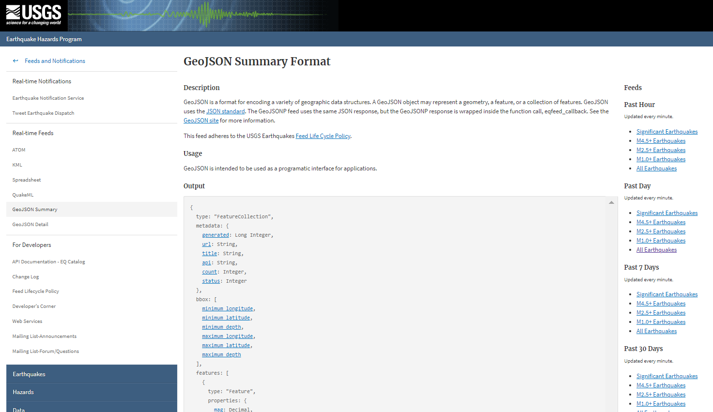
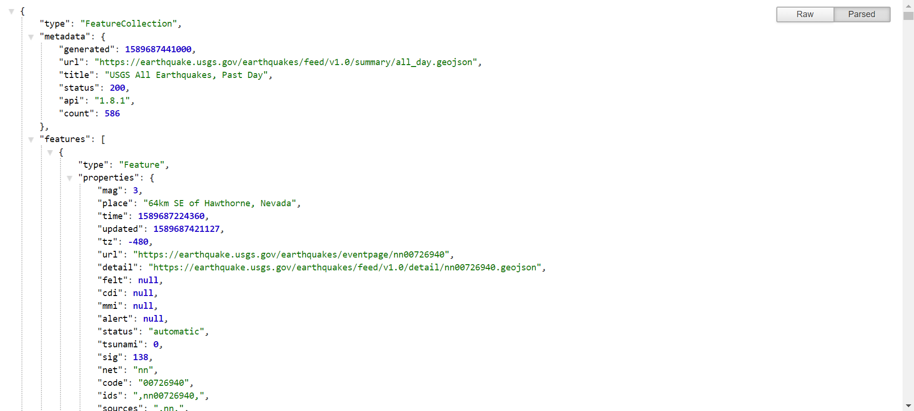
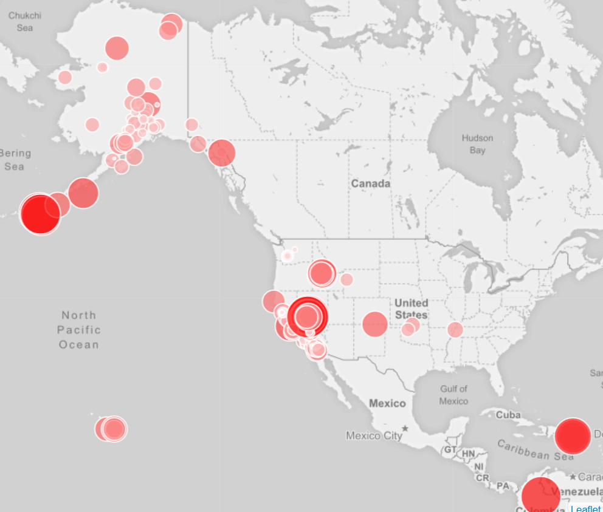

# leaflet-challenge

This project visualizes earthquake data from United States Geological Survey.

The USGS GeoJson data can be accessed here: https://earthquake.usgs.gov/earthquakes/feed/v1.0/geojson.php  

Information is updated every minute, and is organized into different datasets by time and severity.   

  

This project reads in data from all earthquakes in the past day.  

The map was created using Leaflet to visualize the intensity of the earthquakes, with more signifant earthquakes having larger and darker data markers.  When the markers are clicked in the web browser, popups show the intensity and location of the earthquake.  

